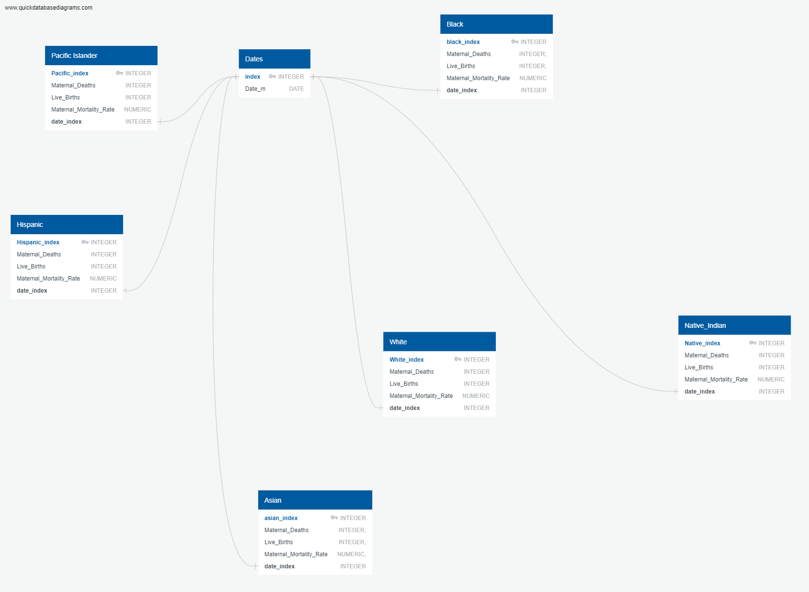
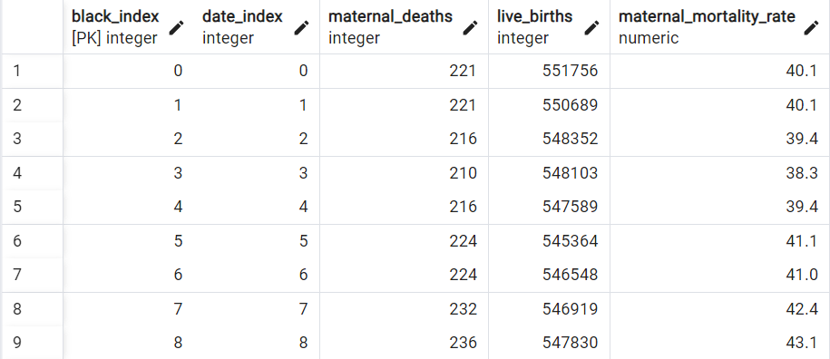
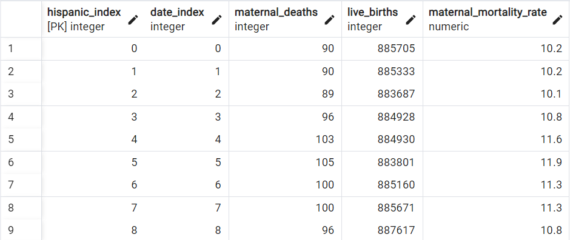
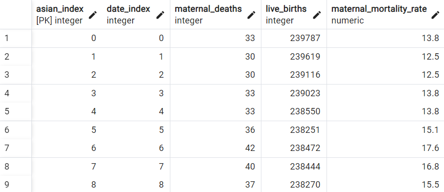
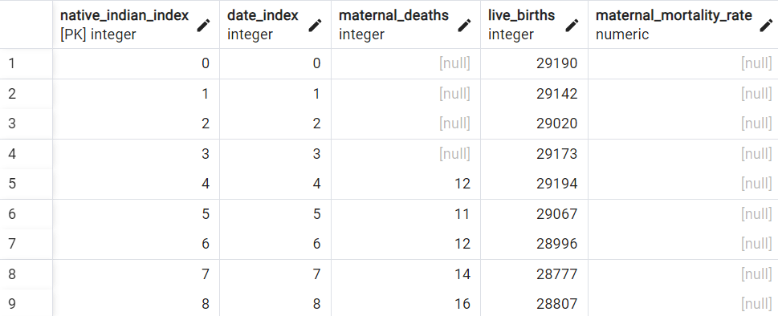
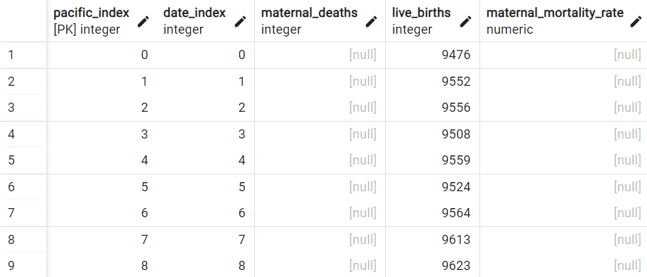

# Project 3: Maternal Mortality - Data Engineering

###### - Team Members: Jair Solano, Hassatou Diallo, Karen Lin   - Data Source: https://www.cdc.gov/nchs/nvss/vsrr/provisional-maternal-deaths-rates.htm

### **Abstract**
This project aims to investigate the disparities in maternal mortality rates across different demographics in the United States using a framework of analyzing data. Maternal mortality, defined as the death of a woman during pregnancy, delivery and or following shortly after the delivery, is a critical indicator of a country's healthcare quality. In the U.S., significant disparities exist in maternal mortality rates, particularly among different racial, ethnic, and socioeconomic groups.

The purpose of this project is to explore and highlight these disparities by using what we learn from class to process, analyze, and visualize relevant data. While we wished to analyze socioeconomic factors and healthcare access through data, the dataset we were able to find and utilize only had maternal mortality data for various racial and age groups. We chose to focus on racial groups for this project. 

### **How to interact with the project**
To interact with this project, the user needs the Jupyter notebook, the csv file consisting of the raw data, the Postgresql database, and the Flask API. First, the user needs to run the Jupyter notebook that reads in, cleans the raw data, and exports the cleaned data as csv files. Then, to store the cleaned data in the Postgresql database, the user runs the .sql file in pgAdmin to create the database schema. After that, the user uses the functionalities of PgAdmin to populate the tables with the cleaned data.Finally, to query the data from the database, the user utilizes the Flask API in the .py file. The user needs to change the code in the .py file in line 13 to reflect the username and password of their own server.

### **Database**
The cleaned data was organized into tables with each table representing a racial group. Each table has a primary key called '<Name_of_Racial_Group>.index' and a foregin key called 'Date_index.' The purpose of creating the 'Date_index' was to connect the table for each racial group to a table containing a list of all the dates.
<li>ERD of the database </li>

<li>Table for data on Black maternal mortality </li>

<li>Table for data on Hispanic maternal mortality </li>

<li>Table for data on Asian maternal mortality </li>

<li>Table for data on Native-American maternal mortality </li>

<li>Table for data on Pacific Islander/Hawaiian maternal mortality </li>

### **Ethics and Considerations**
We did careful consideration of the potential for bias in data collection and analysis. To approach this issue we pull our datasets from a credible source such as the CDC. The data was critically examined for any inherent biases. It is important to note that we believed the CDC would have the most money and resources to allocate information from the Indigenous population.  As mentioned in our slides, this group in particular is small so it can skew with researchers' data which oftentimes researchers stray away from collecting their data. A concern we address during our presentation is about how the data may not represent the experiences of women in different geographic locations because data could be disproportionately collected from urban hospitals rather than rural areas. Additionally, the project maintained a focus on respectful representation and analysis of all demographic groups, aiming to highlight disparities without reinforcing stereotypes or perpetuating stigma.  

### **External Codes Sources**
The code that we used to replace the '/' in the initial column 'Month Ending Date' of the raw data was obtained from https://stackoverflow.com/questions/61653697/pandas-str-replace-with-regex
This code uses Regex along with Pandas's .str() method

